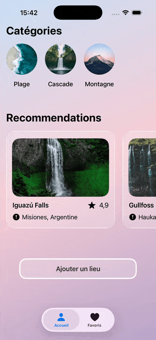

 # Traveling 🌴✈️☀️

  Application iOS de recommandations de voyage construite en **SwiftUI**. L'utilisateur parcourt des destinations classées
  par catégorie (Plage, Cascade, Montagne), consulte leur fiche détaillée, les ajoute à ses favoris et suit lesquelles il a
  déjà visitées.


  <p align="center">
    
  </p>

  ## Stack technique

  | Élément | Choix |
  |---|---|
  | Langage | Swift 6.2+ |
  | UI | SwiftUI |
  | Cible | iOS 26.0+ |
  | Gestion d'état | `@Observable` + `@Environment` |
  | Concurrence | Swift Concurrency moderne |

  ## Architecture

  L'app suit un découpage **MVVM** léger :

  - **Models** — structures de données pures (`Category`, `Recommendation`).
  - **ViewModel** — une classe `@Observable` partagée détenant toutes les données et l'état (catégorie sélectionnée,
  favoris).
  - **View** — vues SwiftUI qui lisent et modifient le `ViewModel` via l'environnement.

  Le `ViewModel` est instancié une seule fois dans `TravelingApp` et injecté dans l'arborescence :

  ```swift
  @main
  struct TravelingApp: App {
      @State private var vm = ViewModel()

      var body: some Scene {
          WindowGroup {
              ContentView()
                  .environment(vm)
          }
      }
  }
  ```

  Chaque vue le récupère ensuite avec `@Environment(ViewModel.self) private var vm`.

  ## Structure du projet

  ```
  Traveling/
  ├── TravelingApp.swift          # Point d'entrée, injection du ViewModel
  ├── Models/
  │   ├── Category.swift          # Catégorie de destination (image + nom)
  │   └── Recommendation.swift    # Destination + enum Filter
  ├── ViewModel/
  │   └── ViewModel.swift         # État global et jeux de données
  └── View/
      ├── ContentView.swift       # TabView racine (Accueil / Favoris)
      ├── HomeView.swift          # Catégories + recommandations + bouton d'ajout
      ├── CategoryView.swift      # Vignette d'une catégorie (sélectionnable)
      ├── RecommendationView.swift# Carte d'une recommandation
      ├── DetailsView.swift       # Fiche détaillée + bouton favori
      ├── AddView.swift           # Formulaire d'ajout d'un lieu
      └── FavoriteView.swift      # Liste des favoris (recherche, filtre, swipe)
  ```

  ## Modèles de données

  ### `Category`
  ```swift
  struct Category: Identifiable {
      let id = UUID()
      var image: ImageResource
      var name: String
  }
  ```

  ### `Recommendation`
  ```swift
  struct Recommendation: Identifiable, Hashable {
      let id = UUID()
      var name: String
      var localization: String
      var description: String?
      var rating: Double?
      var image: ImageResource?
      var isFavorite: Bool?
      var isVisited: Bool = false
  }

  enum Filter {
      case all
      case visited
      case notVisited
  }
  ```

  ## Fonctionnalités

  ### 🏠 Accueil (`HomeView`)
  - Carrousel horizontal des **catégories** ; un tap met à jour `vm.categorySelected` avec animation.
  - Carrousel horizontal des **recommandations** correspondant à la catégorie sélectionnée.
  - Navigation vers la fiche détaillée via `NavigationLink` / `navigationDestination(for:)`.
  - Bouton **« Ajouter un lieu »** qui présente `AddView` en feuille (`.medium`).
  - Fond en dégradé linéaire.

  ### 📄 Détails (`DetailsView`)
  - Image plein cadre, nom, localisation, note avec étoiles, description.
  - Bouton **cœur** dans la barre d'outils pour ajouter/retirer des favoris (l'état est dérivé de `vm.favorites`).

  ### ➕ Ajout (`AddView`)
  - Formulaire à deux champs : pays et localisation.
  - Validation : chaque champ doit faire plus de 3 caractères, sinon une **alerte** s'affiche.
  - À la sauvegarde, ajoute une `Recommendation` aux favoris puis ferme la feuille.

  ### ❤️ Favoris (`FavoriteView`)
  - Liste des lieux favoris avec image, nom, localisation et badge « Visité ».
  - **Recherche** sur le nom et la localisation (`searchable`).
  - **Filtre** via menu : Tout voir / Visité / Non visité.
  - **Swipe** pour basculer l'état visité.
  - **Édition** : réordonnancement (`onMove`) et suppression (`onDelete`).
  - `ContentUnavailableView.search` quand aucun résultat.

  ## Données

  Les recommandations sont actuellement **codées en dur** dans le `ViewModel`, réparties en trois jeux :
  - `beachRecommendations` (Plage)
  - `mountainRecommendations` (Montagne)
  - `waterfallRecommendations` (Cascade)

  Les favoris (`favorites`) démarrent vides et sont alimentés à l'exécution.

  ## Lancer le projet

  1. Ouvrir `Traveling.xcodeproj` dans Xcode.
  2. Sélectionner un simulateur iOS 26.0+ (ou un appareil).
  3. Lancer (`⌘R`).

  ## Pistes d'évolution

  - Persistance des favoris (SwiftData) — aujourd'hui l'état est perdu à la fermeture.
  - Compléter `AddView` (catégorie, note, image, description).
  - Extraire la logique de filtrage/sélection dans le `ViewModel` pour la rendre testable.
  - Ajouter des tests unitaires sur la logique métier.
